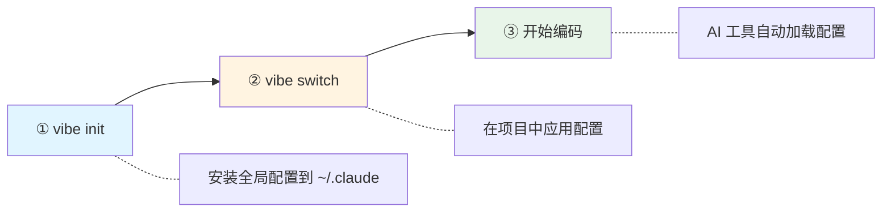
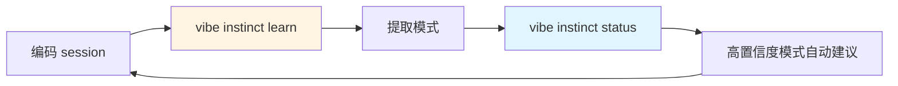

# VibeSOP

[English](README.md) | **中文**

经过实战检验的多平台 AI 辅助开发工作流 SOP——支持 Claude Code、OpenCode 及未来更多平台，提供结构化配置、记忆管理和一致的开发实践。

**不是教程，不是玩具配置。是一套真正能落地交付的生产 SOP——具备跨工具的可移植核心规范。**

> **📖 初次使用本项目？** 请先阅读 [PRINCIPLES.md](PRINCIPLES.md) —— 这是所有贡献者必读文档，涵盖我们的核心理念：生产优先、结构化优于提示、记忆优于智能、验证优于自信、可移植优于特定。

## VibeSOP 与原始项目的差异

VibeSOP fork 自 [runesleo/claude-code-workflow](https://github.com/runesleo/claude-code-workflow)。原始项目是一套扎实的 Claude Code 配置模板，VibeSOP 在此基础上进行了大幅扩展：

| | runesleo/claude-code-workflow | VibeSOP |
|---|---|---|
| 平台支持 | 仅 Claude Code | Claude Code + OpenCode + 可扩展至未来平台 |
| 核心规范 | 与 Claude Code 耦合 | 可移植 `core/`（模型、技能、策略、安全） |
| CLI | 基础 shell 脚本 | 完整 Ruby CLI（`bin/vibe`），8 个命令 |
| 架构 | 单文件配置 | 22 个模块化 Ruby 库 |
| Windows 支持 | 仅 WSL2 / Git Bash | 原生 cmd.exe 批处理脚本，跨平台检测 |
| 定制化 | 手动编辑文件 | Overlay 系统（`.vibe/overlay.yaml`） |
| 测试覆盖 | 无 | 289 个测试，SimpleCov 覆盖率强制执行 |
| 技能系统 | 静态 Markdown | 可移植技能注册表 + 安全审计 |
| 记忆系统 | 单文件 | 三层架构（session / project-knowledge / overview） |
| 文档 | 英文 | 英文 + 中文（`README.zh-CN.md`） |

### 关键架构决策

**可移植核心**（`core/`）：所有模型层级、技能定义、安全策略和行为规则均以平台无关的 YAML 存储。目标适配器（Claude Code、OpenCode 等）消费这个核心——添加新平台无需重写工作流逻辑。

**生成器 CLI**（`bin/vibe`）：无需手动复制配置文件，`vibe generate` 从可移植核心 + 项目 overlay 构建正确的目标文件，升级和平台切换均为非破坏性操作。

**Overlay 系统**：项目特定的偏差写入 `.vibe/overlay.yaml`，而非修改共享默认值，基础工作流保持可升级性。

## 项目来源

- **原作者**：[@runes_leo](https://x.com/runes_leo)
- **Fork 维护者**：[@nehcuh](https://github.com/nehcuh)

本 fork 保持原始 MIT 许可证并致谢原作者。如果你只需要 Claude Code 支持且偏好更简单的配置，原始项目可能更适合你。

## 最新更新 (2026-03)

- **🛠️ Skill Craft 系统**：从自己的会话历史中生成可复用的个人技能
  - `vibe skill-craft` — 交互式会话：分析 → 选择模式 → 生成技能
  - `vibe skill-craft analyze` — 检测重复工具序列、错误恢复流程和工作流
  - `vibe skill-craft generate --pattern <id> [--force]` — 从检测到的模式生成技能
  - `vibe skill-craft status` — 查看会话计数和上次评审时间
  - 自动保存到 `~/.claude/skills/personal/`
- **🔧 gstack 集成**：虚拟工程团队作为可插拔技能包
  - 21 个技能覆盖 7 个冲刺阶段（构思 → 规划 → 开发 → 审查 → 测试 → 发布 → 回顾）
  - `vibe init` 时自动检测，触发规则自动生成到 `skill-triggers.md`
  - 浏览器 QA、跨模型审查、发布自动化、安全护栏
  - 与内置技能互补 — gstack 负责产品/审查/发布，VibeSOP 负责记忆/验证/会话
  - 通过 `vibe init` 自动安装，或手动：`git clone https://github.com/garrytan/gstack.git ~/.claude/skills/gstack`
- **🧠 Instinct 学习系统**：从 session 中自动提取可复用模式
  - `vibe instinct learn` — 提取或手动创建可复用模式
  - `vibe instinct status` — 按置信度分组查看 instinct
  - `vibe instinct export/import` — 团队共享（支持 3 种合并策略）
  - `vibe instinct evolve` — 将高质量 instinct 升级为正式 skill
  - 置信度评分：成功率 (60%) + 使用频率 (30%) + 来源多样性 (10%)
  - 集成到 session-end 工作流，自动学习
- **🪟 原生 Windows 支持**：cmd.exe 批处理脚本，适用于企业环境
  - `bin/vibe-install.bat` — 无需管理员权限的 Windows 安装
  - `hooks/pre-session-end.bat` — Windows hook 支持
  - 跨平台命令检测（`which`/`where`）
  - Windows 上使用文件复制替代符号链接

## 为什么需要它

Claude Code 开箱即强大，但缺乏结构时它只是一个「每次重新开始」的智能助手。这套模板提供**结构化工作流系统**：

- **提示结构化记忆实践**：将经验教训记录到 markdown 文件，以便搜索过去的错误
- **分层组织上下文**：规则（始终）、文档（参考）、记忆（工作状态）
- **建议基于能力的路由**：将任务复杂度与适当模型匹配的指南
- **强制验证检查点**：在声称完成前要求显式测试执行
- **支持会话管理**：当您发出完成信号时，保存进度的结构化模板
- **提供可移植技能指南**：何时使用特定技能的基于规则的指导（TDD、代码审查等）

**重要**：这是一个带有提示和规则的配置模板——不是自动化。您和您的 LLM 必须主动使用该结构。

## 架构概览

```
┌─────────────────────────────────────────────────────┐
│                    项目 Overlay                       │
│  .vibe/overlay.yaml 或 --overlay FILE               │
│  项目级自定义: 配置映射 / 行为策略 / 原生配置补丁     │
└──────────────────────┬──────────────────────────────┘
                       │ 合并
┌──────────────────────▼──────────────────────────────┐
│                  可移植核心 (core/)                    │
│                                                      │
│  models/tiers.yaml      能力层级定义                  │
│  models/providers.yaml  目标/供应商配置映射            │
│  skills/registry.yaml   可移植技能注册表              │
│  security/policy.yaml   P0/P1/P2 安全策略             │
│  policies/behaviors.yaml 可移植行为策略               │
└──────────────────────┬──────────────────────────────┘
                       │ bin/vibe build
┌──────────────────────▼──────────────────────────────┐
│               目标适配器 (targets/)                    │
│                                                      │
│  claude-code.md  opencode.md                         │
└──────────────────────┬──────────────────────────────┘
                       │ 渲染
┌──────────────────────▼──────────────────────────────┐
│              生成输出 (generated/<target>/)            │
│                                                      │
│  Claude Code → CLAUDE.md + rules/ + settings.json    │
│  OpenCode    → AGENTS.md + opencode.json             │
└─────────────────────────────────────────────────────┘
```

### 数据分层

| 层级 | 目录 | 加载策略 | 用途 |
|------|------|----------|------|
| Layer 0 | `rules/` | 始终加载 | 核心行为规则、技能触发、会话管理 |
| Layer 1 | `docs/` | 按需加载 | 多模型协作、安全审查、路由参考 |
| Layer 2 | `memory/` | 热数据 | 每日进度、活跃任务、项目状态 |
| 技能 | `skills/` | 按触发条件 | 系统调试、完成验证、会话结束 |
| 代理 | `agents/` | 按需分派 | PR 审查、安全审计、性能分析 |

### 模块化 CLI 架构

`bin/vibe` 由 22 个 Ruby 模块组成：

| 模块 | 职责 |
|------|------|
| `Vibe::Utils` | 通用工具：深度合并、I/O、路径处理、格式化 |
| `Vibe::DocRendering` | Markdown 文档渲染：inspect 输出、行为/路由/安全文档 |
| `Vibe::OverlaySupport` | Overlay 解析、发现、策略合并 |
| `Vibe::NativeConfigs` | 原生配置构建：Claude settings.json、Cursor cli.json、OpenCode opencode.json |
| `Vibe::PathSafety` | 输出路径安全守卫、目标冲突检查、文件树复制 |
| `Vibe::TargetRenderers` | 8 个目标的文件渲染器 |
| `Vibe::Builder` | 目标构建编排 |
| `Vibe::InitSupport` | 集成检测和设置 |
| `Vibe::ExternalTools` | 外部工具集成逻辑 |
| `Vibe::IntegrationManager` | 集成检测和管理 |
| `Vibe::IntegrationSetup` | 集成设置和配置 |
| `Vibe::IntegrationVerifier` | 集成验证 |
| `Vibe::IntegrationRecommendations` | 集成推荐 |
| `Vibe::PlatformUtils` | 平台相关工具 |
| `Vibe::PlatformInstaller` | 平台安装逻辑 |
| `Vibe::PlatformVerifier` | 平台验证 |
| `Vibe::RtkInstaller` | RTK 安装逻辑 |
| `Vibe::SuperpowersInstaller` | Superpowers 安装逻辑 |
| `Vibe::QuickstartRunner` | 快速启动设置逻辑 |
| `Vibe::UserInteraction` | 用户交互和提示 |
| `Vibe::Version` | 版本信息 |
| `Vibe::Errors` | 自定义错误类（支持上下文信息）|

---

## 已知限制

在采用此工作流之前，请了解这些约束：

### 平台支持
- **生产就绪**：Claude Code、OpenCode
- **计划中**：Cursor、Warp、VS Code、Kimi Code、Codex CLI、Antigravity（已生成配置但测试有限）

### 这是什么（以及不是什么）
- **不是自动的**：这是带有提示和规则的配置模板——不是自动化
- **不是魔法**：您和您的 LLM 必须主动阅读并遵循规则
- **不是数据库**："记忆"是 markdown 文件；没有搜索，没有自动检索
- **不是钩子**：没有程序化触发器；一切都取决于 LLM 识别提示

### 记忆系统
- **没有自动保存**：仅当您明确说出退出短语（"I'm heading out"、"保存一下"）时才记录
- **没有崩溃恢复**：如果 Claude Code 崩溃，未保存的工作将丢失
- **没有自动关联**：不会自动建议过去的教训；Claude 必须读取并记住

### 技能系统
- **不是自动触发**：规则描述何时*应该*使用技能，但 LLM 必须解释
- **没有强制执行**："强制性"技能是提示，不是程序化门控

### 模型路由
- **仅是指南**：能力层级是语义提示，不是可执行配置
- **没有动态切换**：不能在中途自动更换模型

### 外部集成
- **需要手动设置**：Superpowers 和 RTK 检测找到工具但需要用户确认
- **RTK 范围**：仅优化命令输出，不减少整体对话 token 使用

---

## 快速上手

### 30 秒安装

```bash
git clone https://github.com/nehcuh/vibesop.git && cd vibesop
bin/vibe-install          # macOS/Linux
bin\vibe-install.bat      # Windows (cmd.exe)
```

### 3 步开始使用



```bash
# ① 安装全局配置（选择你的 AI 工具）
vibe init --platform claude-code     # Claude Code 用户
vibe init --platform opencode        # OpenCode 用户

# ② 在项目中应用
cd ~/my-project
vibe switch --platform claude-code

# ③ 启动 AI 工具，配置自动生效
claude                               # 或 opencode
```

### 常见场景

#### 场景 1：我只用 Claude Code，想快速配好

```bash
vibe quickstart                      # 一键配置 ~/.claude
cd ~/my-project && vibe switch --platform claude-code
claude                               # 开始编码
```

#### 场景 2：我想在多个 AI 工具间切换

```bash
vibe init --platform claude-code     # 安装 Claude Code 配置
vibe init --platform opencode        # 安装 OpenCode 配置

cd ~/my-project
vibe switch --platform claude-code   # 用 Claude Code
vibe switch --platform opencode --force  # 切换到 OpenCode
```

#### 场景 3：我想定制项目配置

```bash
cd ~/my-project
vibe switch --platform claude-code

# 创建项目级 overlay（覆盖默认配置）
cat > .vibe/overlay.yaml << 'EOF'
profile: node-fullstack
policies:
  test_command: "npm test"
  lint_command: "npm run lint"
EOF

vibe switch --platform claude-code   # 重新应用（含 overlay）
```

#### 场景 4：我想用 Instinct 学习系统积累经验



```bash
# 手动创建一个 instinct
vibe instinct learn --pattern "修复 Ruby 语法错误前先跑 rubocop" --tags ruby,linting

# 查看已学习的模式
vibe instinct status

# 团队共享
vibe instinct export team-patterns.yaml --min-confidence 0.8
vibe instinct import team-patterns.yaml --merge
```

#### 场景 5：Windows 企业环境（无 PowerShell）

```cmd
REM 使用 cmd.exe 原生安装
bin\vibe-install.bat

REM 安装 hooks
cd hooks
install.bat
```

详见 [Windows 安装指南](docs/windows-installation.md)。

### 验证安装

```bash
vibe doctor                          # 检查环境和集成状态
vibe targets                         # 查看支持的平台
vibe --version                       # 查看版本
```

### 卸载

```bash
bin/vibe-uninstall                   # 仅移除 vibe 命令
bin/vibe-uninstall --remove-configs  # 移除 vibe + 平台配置
bin/vibe-uninstall --remove-all      # 移除所有（含 ~/.vibe）
bin/vibe-uninstall --dry-run         # 预览将被移除的内容
```

---

## 模型配置指南

本工作流使用**能力层级路由系统**，将任务复杂度与具体模型实现分离。理解如何为你的目标工具配置模型对于获得最佳性能至关重要。

### 理解能力层级

工作流在 `core/models/tiers.yaml` 中定义了 5 个抽象能力层级：

- **`critical_reasoner`**：关键逻辑、安全、密钥和架构决策的最高保障推理
- **`workhorse_coder`**：大多数实现和分析工作的默认日常编码层级
- **`fast_router`**：用于探索、分类和低风险子流程工作的快速廉价层级
- **`independent_verifier`**：用于交叉检查重要结论的第二模型验证层级
- **`cheap_local`**：用于离线、高容量和低风险任务的本地或接近零成本层级

### 层级到模型的映射机制

每个目标在 `core/models/providers.yaml` 中都有一个**提供者配置文件**，将这些抽象层级映射到具体的模型实现：

```yaml
claude-code-default:
  mapping:
    critical_reasoner: claude.opus-class
    workhorse_coder: claude.sonnet-class
    fast_router: claude.haiku-class
```

**重要提示**：这些映射是**语义提示**，而非可执行配置。实际的模型选择取决于你的目标工具的能力。

### 按目标配置模型

#### Claude Code（完全支持）

Claude Code 通过多种方法支持动态模型选择：

**方法 1：使用特定模型启动**
```bash
# 使用 Opus 启动（最高能力）
claude --model opus

# 使用 Sonnet 启动（平衡）
claude --model sonnet

# 使用 Haiku 启动（最快）
claude --model haiku
```

**方法 2：使用 Task 工具的 model 参数**
```markdown
委派给子代理时，Claude 可以指定模型层级：
- Task 工具使用 `model: "opus"` 进行关键推理
- Task 工具使用 `model: "sonnet"` 进行标准工作
- Task 工具使用 `model: "haiku"` 进行快速探索
```

**方法 3：在设置中配置默认值**
检查 `~/.claude/settings.json` 以配置默认模型偏好（如果你的 Claude Code 版本支持）。

#### OpenCode（完全支持）

OpenCode 允许在 `opencode.json` 中灵活配置模型：

```json
{
  "models": {
    "primary": "claude-opus-4",
    "coder": "claude-sonnet-4",
    "fast": "claude-haiku-4"
  }
}
```

生成的配置将这些映射到工作流中定义的能力层级。

#### 其他平台（计划中）

以下平台的适配器文档已生成，但尚未完全实现：

- **Cursor** - UI 设置配置
- **Warp** - AI 提供者集成
- **VS Code / Copilot** - Copilot Chat 扩展
- **Kimi Code** - SKILL.md 文件支持
- **Codex CLI** - OpenAI 模型配置
- **Antigravity** - 多代理工作流

欢迎社区贡献！

### 项目特定的模型覆盖

你可以使用 overlay 为特定项目覆盖默认的层级到模型映射：

```yaml
# .vibe/overlay.yaml
profile:
  mapping:
    critical_reasoner: claude.opus-4-latest
    workhorse_coder: claude.sonnet-4-latest
```

然后使用 overlay 构建：
```bash
bin/vibe build claude-code --overlay .vibe/overlay.yaml
```

### 成本优化技巧

1. **使用正确的层级**：不要对简单任务使用 `critical_reasoner`（Opus）
2. **利用 `fast_router`**：对探索和快速查找使用 Haiku 级模型
3. **启用 `cheap_local`**：为提交消息和格式化配置 Ollama 或类似工具
4. **有选择地交叉验证**：仅对真正关键的决策使用 `independent_verifier`

详细的路由指南请参见 `docs/task-routing.md`。

### 方式二：使用生成器（推荐，支持多目标）

```bash
# 构建指定目标（完全支持）
bin/vibe build claude-code
bin/vibe build opencode

# 应用到目标目录
bin/vibe use claude-code --destination ~/.claude
bin/vibe use opencode --destination ~/.config/opencode

# 快速切换当前仓库的目标配置
bin/vibe switch claude-code
bin/vibe switch opencode

# 查看当前状态
bin/vibe inspect
bin/vibe inspect --json
```

### 方式三：使用项目 Overlay（团队/项目定制）

在你的项目根目录创建 `.vibe/overlay.yaml`：

```yaml
name: my-project
description: 项目级工作流定制

profile:
  mapping_overrides:
    workhorse_coder: openai.gpt-4o
  note_append:
    - 本项目使用 Python + uv 管理依赖

policies:
  append:
    - id: python-uv-preference
      category: project
      enforcement: recommended
      target_render_group: always_on
      summary: 优先使用 uv run、uv sync 管理 Python 环境

targets:
  claude-code:
    permissions:
      ask:
        - "Bash(docker:*)"
```

然后构建时会自动发现并应用：

```bash
bin/vibe switch cursor  # 自动应用 .vibe/overlay.yaml
```

**路径安全机制**：使用 `use` 或 `switch` 命令时，如果默认输出目录（`generated/<target>/`）与目标目录重叠，工具会自动使用外部暂存目录 `~/.vibe-generated/<目标名>-<哈希>/<target>/` 来避免冲突。这确保了即使将配置应用到仓库根目录也能安全操作。

```bash
bin/vibe build cursor                   # 自动发现 .vibe/overlay.yaml
bin/vibe build warp --overlay my.yaml   # 或显式指定
```

仓库已附带三个示例 overlay：

- `examples/python-uv-overlay.yaml` — Python/uv 项目偏好
- `examples/node-nvm-overlay.yaml` — Node/nvm 项目偏好
- `examples/project-overlay.yaml` — 严格审查流程示例

## 生成的配置文件

`bin/vibe build` 为每个目标生成不同的配置文件：

### Claude Code 目标（完全支持）
- `CLAUDE.md`, `rules/`, `docs/`, `skills/`, `agents/`, `commands/`, `memory/`
- `settings.json` — 权限基线
- `.vibe/claude-code/` — 行为策略、安全策略、任务路由、测试标准

### OpenCode 目标（完全支持）
- `AGENTS.md` — 工作流概述
- `opencode.json` — 配置和指令
- `.vibe/opencode/` — 行为策略、通用、路由、技能、安全、执行

### 其他目标（计划中）

以下平台的配置已生成但测试有限：
- **Antigravity** — `AGENTS.md` + `.vibe/antigravity/`
- **Warp** — `WARP.md` + `.vibe/warp/`
- **Cursor** — `AGENTS.md` + `.cursor/rules/*.mdc`
- **Codex CLI** — `AGENTS.md` + `.vibe/codex-cli/`
- **VS Code** — `AGENTS.md` + `.vibe/vscode/`

### 任务路由和测试标准

所有目标现在都包含：
- **任务路由** (`task-routing.md`) — 按复杂度分类任务（trivial/standard/critical），定义每个级别的流程要求
- **测试标准** (`test-standards.md`) — 按复杂度定义最低测试覆盖率要求，标识关键路径

这些策略帮助 AI 助手根据任务复杂度自动调整工作流程，在质量和效率之间取得平衡。

## 外部工具集成

本工作流支持可选的外部工具集成以增强能力：

### 初始化集成

```bash
# 交互式设置（需要指定平台）
bin/vibe init --platform claude-code

# 验证现有安装
bin/vibe init --platform claude-code --verify

# 查看建议
bin/vibe init --platform claude-code --suggest

# 检查所有平台和集成状态
bin/vibe doctor
```

### 支持的集成

#### Superpowers 技能包

提供设计优化、TDD 强制执行、系统化调试等高级技能包。

**安装方式**：
- Claude Code: `/plugin marketplace add obra/superpowers-marketplace`
- Cursor: `/plugin-add superpowers`
- 手动: 克隆并符号链接到 `~/.claude/skills/`
**本工作流暴露的可移植技能 ID**：
- `superpowers/tdd`
- `superpowers/brainstorm`
- `superpowers/refactor`
- `superpowers/debug`
- `superpowers/architect`
- `superpowers/review`
- `superpowers/optimize`

安装后的 Superpowers 技能包可能使用不同的原生命名。`core/skills/registry.yaml` 仍然是 `bin/vibe` 渲染这些可移植 ID 时的单一事实来源。

**来源**: [obra/superpowers](https://github.com/obra/superpowers)

#### RTK (Token 优化器)

通过智能上下文管理将 LLM token 消耗减少 60-90% 的 CLI 代理工具。

**安装方式**：
```bash
# Homebrew (macOS/Linux)
brew install rtk

# Cargo
cargo install --git https://github.com/rtk-ai/rtk

# 手动下载
# 参考 GitHub Releases: https://github.com/rtk-ai/rtk/releases

# 初始化 hook
rtk init --global
```
`bin/vibe init` 只会自动执行 Homebrew 和 Cargo 路径；如果选择手动安装，它会给出 release 下载指引，而不会执行远程安装脚本。

**来源**: [rtk-ai/rtk](https://github.com/rtk-ai/rtk)

**验证状态**：
- **Ready**：RTK 二进制已安装，且 Claude hook 已配置完成
- **Installed, hook not configured**：RTK 已安装，但还需要执行 `rtk init --global`
- **Hook configured, binary not found**：Claude 配置里残留了 hook，但当前并未找到 RTK 二进制

### 集成行为

- **条件性**: 所有集成都是可选的。工作流在没有它们的情况下正常运行。
- **动态检测**: 只有在检测到已安装 Superpowers 时，相关技能才会出现在生成的 manifest 和文档中。
- **可移植 SSOT**: 生成产物中的 Superpowers 引用使用 `core/skills/registry.yaml` 中的可移植 ID，而不是技能包自身的命名。
- **安全性**: 外部技能在注册到 `core/skills/registry.yaml` 之前会经过安全审查。

详细集成文档请参阅 `docs/integrations.md`。

## 目录结构

```
vibesop/
├── CLAUDE.md                     # 入口文件 — Claude 首先读取此文件
├── README.md                     # 英文说明
├── README.zh-CN.md               # 中文说明（本文件）
│
├── bin/
│   ├── vibe                      # 生成器 CLI（build/use/inspect/switch）
│   ├── vibe-init                 # 集成初始化向导
│   ├── vibe-smoke                # 冒烟测试（所有目标 + overlay 构建）
│   └── validate-schemas          # JSON schema 验证工具
│
├── lib/vibe/                     # CLI 模块化实现（9 个模块）
│   ├── utils.rb                  # 通用工具
│   ├── doc_rendering.rb          # 文档渲染
│   ├── overlay_support.rb        # Overlay 支持
│   ├── native_configs.rb         # 原生配置构建
│   ├── path_safety.rb            # 路径安全
│   ├── target_renderers.rb       # 目标渲染器
│   ├── init_support.rb           # 集成检测和设置
│   ├── external_tools.rb         # 外部工具集成逻辑
│   └── errors.rb                 # 自定义错误类
│
├── test/                         # 单元测试（7 个测试文件）
│   ├── test_vibe_cli.rb
│   ├── test_vibe_overlay.rb
│   ├── test_vibe_init.rb
│   ├── test_vibe_external_tools.rb
│   ├── test_path_overlap_calculation.rb
│   ├── test_cli_path_safety_guards.rb
│   └── test_vibe_utils.rb
│
├── schemas/                      # JSON schemas（用于 core/ 验证）
│   ├── providers.schema.json
│   ├── security.schema.json
│   └── skills.schema.json
│
├── core/                         # 可移植核心规范
│   ├── README.md                 # 可移植架构 + 迁移规则
│   ├── models/                   # 能力层级 + 供应商配置
│   │   ├── tiers.yaml
│   │   └── providers.yaml
│   ├── skills/                   # 技能注册表
│   │   └── registry.yaml
│   ├── security/                 # 安全策略
│   │   └── policy.yaml
│   ├── policies/                 # 行为策略
│   │   ├── behaviors.yaml
│   │   ├── task-routing.yaml
│   │   └── test-standards.yaml
│   └── integrations/             # 集成元数据
│       ├── README.md
│       ├── superpowers.yaml
│       └── rtk.yaml
│
├── targets/                      # 目标适配器契约文档
│   ├── README.md
│   ├── antigravity.md
│   ├── claude-code.md
│   ├── codex-cli.md
│   ├── cursor.md
│   ├── kimi-code.md
│   ├── opencode.md
│   ├── vscode.md
│   └── warp.md
│
├── .vibe/                        # 生成的目标支撑文件（已跟踪）
│   ├── manifest.json             # 目标构建清单
│   ├── target-summary.md         # 快速参考
│   └── <target>/                 # 每个目标的生成文档
│       ├── behavior-policies.md
│       ├── routing.md
│       ├── safety.md
│       ├── skills.md
│       ├── task-routing.md
│       └── test-standards.md
│
├── generated/                    # 构建输出（gitignore）
│   ├── <target>/                 # 具体化的目标配置
│   └── golden-files/             # 快照测试参考文件
│
├── examples/                     # 示例 overlay 文件
│   ├── node-nvm-overlay.yaml
│   ├── project-overlay.yaml
│   └── python-uv-overlay.yaml
│
├── rules/                        # Layer 0: 始终加载
│   ├── behaviors.md              # 核心行为规则
│   ├── skill-triggers.md         # 技能触发条件
│   └── memory-flush.md           # 会话结束触发器
│
├── docs/                         # Layer 1: 按需加载
│   ├── README.md
│   ├── agents.md                 # 多模型协作框架
│   ├── task-routing.md           # 任务路由参考
│   ├── project-overlays.md       # Overlay 机制文档
│   ├── integrations.md           # 外部工具集成指南
│   └── ...
│
├── memory/                       # Layer 2: 工作状态（3层架构）
│   ├── session.md                # 热层：每日进度 + 进行中任务
│   ├── project-knowledge.md      # 温层：技术陷阱 + 模式
│   └── overview.md               # 冷层：目标 + 项目 + 基础设施
│
├── skills/                       # 可复用技能定义
│   ├── systematic-debugging/     # 五阶段系统调试
│   ├── verification-before-completion/
│   ├── session-end/
│   ├── planning-with-files/
│   └── experience-evolution/
│
├── agents/                       # 自定义代理
│   ├── pr-reviewer.md
│   ├── security-reviewer.md
│   └── performance-analyzer.md
│
├── commands/                     # 自定义斜杠命令
│   ├── debug.md                  # /debug — 启动系统调试
│   ├── deploy.md                 # /deploy — 部署前检查清单
│   ├── exploration.md            # /exploration — 编码前 CTO 挑战
│   └── review.md                 # /review — 准备代码审查
│
└── memory/                       # 跨项目可复用模式和陷阱记录
```
## Git 与提交边界

这个仓库有意把「共享工作流文件」和「一次性构建/本地状态」分开管理：

- 应提交：`core/`、`targets/`、`rules/`、`docs/`、`CLAUDE.md`、`WARP.md`，以及当前仓库中已纳入版本控制的 `.vibe/` 支撑文件。
- 不应提交：`generated/` 和 `.vibe-target.json` 这类 staging 输出与本地 apply marker。
- `.vibe/overlay.yaml` 只有在它代表团队共享的项目策略时才建议提交；如果只是个人或本地偏好，应放在仓库外部，或在消费仓库的 `.gitignore` 中忽略。

完整说明请参阅 `docs/git-workflow.md`，其中包含消费仓库的提交建议、`memory/` 目录策略，以及 secrets / 本地状态文件的处理原则。

## 核心概念

### SSOT（单一事实来源）

每条信息有且仅有一个规范位置。`CLAUDE.md` 中的 SSOT 表将信息类型映射到文件，Claude 在写入前会先检查 SSOT，防止「同一信息散落在 5 个地方，全部过时」的问题。

### 能力层级路由

按能力而非模型名称路由任务，然后映射到当前活跃的供应商配置：

| 层级 | 用途 | 典型场景 |
|------|------|----------|
| `critical_reasoner` | 关键推理 | 安全敏感逻辑、架构决策 |
| `workhorse_coder` | 日常开发 | 大部分编码任务、分析、重构 |
| `fast_router` | 快速响应 | 简单查询、子代理任务 |
| `independent_verifier` | 独立验证 | 交叉验证、代码审查 |
| `cheap_local` | 本地廉价 | 提交消息、格式化、离线工作 |

### 完成前验证

最具影响力的规则：Claude 在声称工作完成前，必须运行验证命令并读取输出。消除 AI 编码的头号失败模式——「应该可以了」但没有实际检查。

### 会话管理

工作流提供结构化模板用于记录会话进度。触发方式：
- 显式退出短语："I'm heading out"、"保存一下"、"结束了"
- 调用 session-end 技能
- 直接编辑 `memory/session.md`

**注意**：这不是自动保存。如果 Claude Code 崩溃，未保存的工作将丢失。

### 项目 Overlay

消费仓库可以通过 `.vibe/overlay.yaml` 自定义：
- **配置映射覆盖** — 重定义能力层级到具体模型的映射
- **行为策略追加** — 添加项目级的行为规则
- **原生配置补丁** — 修改目标工具的权限设置
- **技术栈偏好** — 编码 `uv`、`nvm` 等运行时偏好

所有定制均不需要 fork 或修改 `core/`。

## 定制指南

### 添加新项目

1. 在 `memory/overview.md` 中添加项目条目
2. 在 `CLAUDE.md` 的 Sub-project Memory Routes 中添加路由
3. 在项目根目录创建 `PROJECT_CONTEXT.md`

### 添加新技能

创建 `skills/your-skill/SKILL.md`：

```yaml
---
name: your-skill
description: 技能描述
allowed-tools:
  - Read
  - Write
  - Bash
---

# 你的技能

[Claude 调用此技能时的执行指令]
```

然后在 `core/skills/registry.yaml` 中注册元数据。

### 调整模型路由

1. 编辑 `core/models/tiers.yaml` 和 `core/models/providers.yaml`
2. 同步 `rules/behaviors.md` 和 `docs/task-routing.md`
3. 或使用项目 overlay 局部覆盖，无需修改全局配置

### 运行验证

```bash
# 完整验证（包含所有目标构建 + overlay + 安全检查）
make validate

# 或单独运行冒烟测试
bin/vibe-smoke

# 单元测试
make test
```

## 设计哲学

1. **结构 > 提示词**：组织良好的配置文件胜过巧妙的一次性提示
2. **记忆 > 智能**：记住你过去错误的 AI 比更聪明但每次重新开始的 AI 更有价值
3. **验证 > 自信**：运行测试的成本永远低于发布 broken build 的成本
4. **分层加载 > 平铺配置**：不要把所有东西塞进上下文——规则始终加载、文档按需加载、数据在需要时加载
5. **提示驱动 > 完全手动**：结构化提示引导保存，但仍需用户主动触发

## Windows / WSL 支持

本工作流支持多种 Windows 安装方式：

### 方式 1：原生 Windows（cmd.exe）✨

**适用场景**：企业环境中 PowerShell 受限的情况。

**前置条件**：需要安装 Ruby >= 2.6.0。从 [RubyInstaller](https://rubyinstaller.org/) 获取（推荐 Ruby+Devkit）。

```cmd
REM 使用原生 Windows 批处理脚本安装
bin\vibe-install.bat

REM 安装 hooks（可选）
cd hooks
install.bat
```

**特性**：
- 在 cmd.exe（DOS）中运行，无需 PowerShell
- 安装到 `%USERPROFILE%\.local\bin`
- 无需管理员权限
- 完整 hook 支持（`.bat` 脚本）

详见 [Windows 安装指南](docs/windows-installation.md)。

### 方式 2：WSL 2（推荐，获得完整 Unix 体验）

1. 安装 WSL 2 和 Ubuntu：
   ```powershell
   wsl --install
   ```

2. 在 WSL 内安装 Ruby：
   ```bash
   sudo apt update
   sudo apt install ruby-full
   ```

3. 在 WSL 内正常克隆和使用工作流：
   ```bash
   git clone https://github.com/nehcuh/vibesop.git
   cd vibesop
   bin/vibe quickstart
   ```

4. 从 WSL 访问 Windows 文件：`/mnt/c/Users/你的用户名/`

### 方式 3：Git Bash 回退（功能有限）

如果无法使用 WSL2，但安装了 Git for Windows（自带 Git Bash）：

```bash
# 在 Git Bash 中使用纯 Bash 回退脚本
./bin/vibe-bash.sh targets           # 列出可用目标
./bin/vibe-bash.sh build opencode    # 构建 OpenCode 配置
./bin/vibe-bash.sh switch opencode   # 应用到当前项目
```

**Bash 回退的限制**：
- 无法从 YAML 生成新配置（需要 Ruby）
- 无法应用 overlay 或复杂合并
- 最适合使用 `generated/` 中的预生成配置

### 平台对比

| 方式 | cmd.exe 支持 | 需要管理员 | Hook 支持 | 完整功能 |
|------|-------------|-----------|----------|---------|
| 原生 Windows (.bat) | ✅ 是 | ❌ 否 | ✅ 是 | ✅ 是 |
| WSL 2 | N/A（Linux） | ⚠️ 初始安装需要 | ✅ 是 | ✅ 是 |
| Git Bash | ⚠️ 通过 bash | ❌ 否 | ⚠️ 有限 | ⚠️ 有限 |

**注意**：原生 Windows 支持已可用于生产环境。如果条件允许，WSL 提供最佳的类 Unix 体验。

## 环境要求

- [Claude Code](https://docs.anthropic.com/en/docs/claude-code) CLI（Claude Max 或 API 订阅）
- Ruby >= 2.6.0（用于 `bin/vibe` 生成器）
  - **macOS**：系统自带
  - **Linux**：`sudo apt install ruby-full`（Debian/Ubuntu）或等效命令
  - **Windows**：通过 [RubyInstaller](https://rubyinstaller.org/) 安装（推荐 Ruby+Devkit），或在 WSL 2 内使用 Ruby
  - **运行时依赖**：无（仅使用 Ruby 标准库）
  - **开发依赖**：参见 `Gemfile`（minitest 用于测试）
- 可选：Codex CLI 用于交叉验证
- 可选：Ollama 用于本地模型回退

## 贡献者

- **原作者**：[@runes_leo](https://x.com/runes_leo) - 初始工作流设计与实现
- **Fork 维护者**：[@nehcuh](https://github.com/nehcuh) - 模块化、测试和中文本地化

## 致谢

本项目基于 [@runes_leo](https://x.com/runes_leo) 的原始 vibesop 优秀基础构建。本 fork 旨在提升可维护性并扩展工作流以服务中文开发者，同时保留核心理念。

### 集成的外部项目

本项目集成并借鉴了以下优秀开源项目：

- **[Superpowers](https://github.com/obra/superpowers)** by [@obra](https://github.com/obra)
  高级技能包，提供设计优化、TDD 强制执行、系统化调试等功能。本项目将其作为可选集成，并在 `core/integrations/superpowers.yaml` 中定义了可移植的技能 ID 映射。

- **[RTK (Rust Token Killer)](https://github.com/rtk-ai/rtk)**
  CLI 代理工具，通过智能上下文管理将 LLM token 消耗减少 60-90%。本项目提供自动检测和配置支持。

- **[everything-claude-code](https://github.com/affaan-m/everything-claude-code)** by [@affaan-m](https://github.com/affaan-m)
  Anthropic Hackathon 获奖项目。VibeSOP 的 Instinct 学习系统、Token 优化策略、验证循环系统和并行化方法均直接受此项目研究的启发。

- **[awesome-claude-code](https://github.com/hesreallyhim/awesome-claude-code)** by [@hesreallyhim](https://github.com/hesreallyhim)
  Claude Code 社区精选资源目录。VibeSOP 的 RIPER 工作流、安全扫描器（受 parry 启发）和 TDD Guard 均通过此合集发现并借鉴。

感谢这些项目的作者和贡献者，他们的工作极大地增强了本工作流的能力。

## 许可

MIT — 随意使用、fork、改造。

原始作品版权所有 (c) 2024 runes_leo
修改作品版权所有 (c) 2026 nehcuh

---

**原作者**：[@runes_leo](https://x.com/runes_leo) — 更多 AI 工具见 [leolabs.me](https://leolabs.me) — [Telegram 社区](https://t.me/runesgang)
**Fork 维护者**：[@nehcuh](https://github.com/nehcuh)
