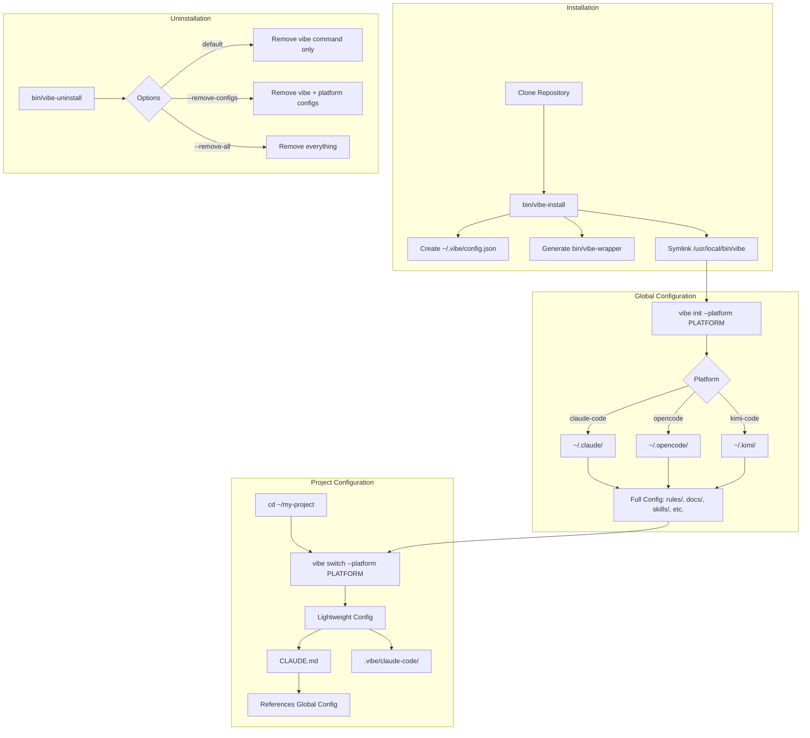
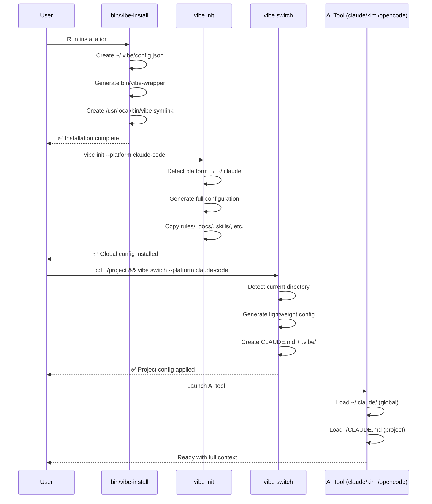
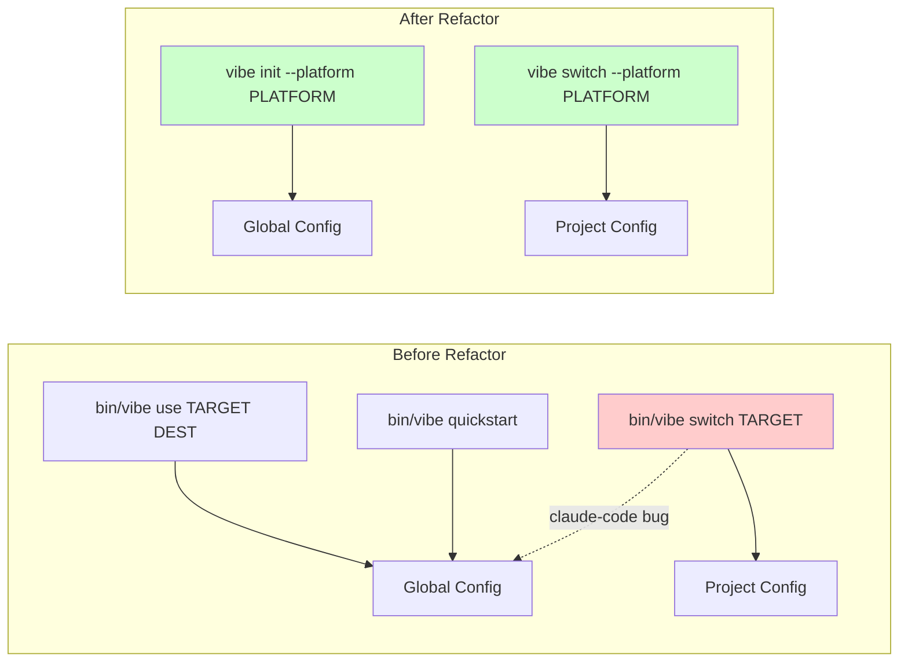

# Installation & Command Refactor

**Date**: 2026-03-10
**Status**: Completed

## Overview

This document describes the major refactoring of the vibe CLI installation and command structure to provide a more intuitive user experience.

## Architecture Overview



## User Workflow



## Command Comparison



## Changes

### 1. System-Level Installation

**New Files:**
- `bin/vibe-install` - Installation script
- `bin/vibe-uninstall` - Uninstallation script
- `bin/vibe-wrapper` - Auto-generated wrapper script (created during installation)
- `~/.vibe/config.json` - Configuration file storing repository path

**Installation Flow:**
```bash
cd ~/claude-code-workflow
bin/vibe-install
# Creates /usr/local/bin/vibe -> bin/vibe-wrapper (requires sudo)
```

**Uninstallation Flow:**
```bash
# Remove vibe command only
bin/vibe-uninstall

# Remove vibe + platform configurations (e.g., ~/.claude, ~/.opencode)
bin/vibe-uninstall --remove-configs

# Remove everything including ~/.vibe directory
bin/vibe-uninstall --remove-all

# Preview what would be removed (dry run)
bin/vibe-uninstall --dry-run
```

**Benefits:**
- Users can run `vibe` from anywhere
- No need to remember the repository path
- Consistent with other CLI tools
- Clean uninstallation with multiple options

### 2. Refactored `init` Command

**Old Behavior:**
- `bin/vibe init` was for managing external integrations (Superpowers, RTK)
- Global configuration used `bin/vibe use` or `bin/vibe quickstart`

**New Behavior:**
- `vibe init --platform PLATFORM` installs global configuration
- Replaces `use` and `quickstart` for typical workflows
- Supports `--verify`, `--suggest`, and `--force` flags

**Examples:**
```bash
vibe init --platform claude-code    # Install to ~/.claude
vibe init --platform opencode       # Install to ~/.opencode
vibe init --platform kimi-code      # Install to ~/.kimi
vibe init --platform claude-code --verify   # Check installation
vibe init --platform claude-code --suggest  # Show suggestions
```

**Platform-to-Directory Mapping:**
| Platform | Global Directory |
|----------|------------------|
| claude-code | `~/.claude` |
| opencode | `~/.opencode` |
| kimi-code | `~/.kimi` |
| cursor | `~/.cursor` |
| codex-cli | `~/.codex` |

### 3. Refactored `switch` Command

**Old Behavior:**
- `bin/vibe switch TARGET` (positional argument)
- For claude-code, defaulted to `~/.claude` (global)

**New Behavior:**
- `vibe switch --platform PLATFORM` (named argument)
- Always applies to current directory (project-level)
- Generates lightweight configuration referencing global setup

**Examples:**
```bash
cd ~/my-project
vibe switch --platform claude-code
vibe switch --platform opencode
vibe switch --platform kimi-code
```

**Project vs Global Mode:**
- **Global mode** (`init`): Full configuration with rules/, docs/, skills/, etc.
- **Project mode** (`switch`): Lightweight CLAUDE.md + .vibe/ reference docs

### 4. Updated User Workflow

**Before:**
```bash
# Clone repo
git clone https://github.com/nehcuh/claude-code-workflow.git
cd claude-code-workflow

# Install global config
bin/vibe use claude-code ~/.claude
# OR
bin/vibe quickstart

# Apply to project
cd ~/my-project
bin/vibe switch claude-code
```

**After:**
```bash
# Install vibe
cd ~/claude-code-workflow
bin/vibe-install

# Install global config
vibe init --platform claude-code

# Apply to project
cd ~/my-project
vibe switch --platform claude-code
```

## Legacy Commands

The following commands remain available for advanced use cases:

- `vibe quickstart` - Shortcut for `vibe init --platform claude-code`
- `vibe use TARGET DESTINATION` - Manual installation to custom location
- `vibe build TARGET` - Generate configuration without installing

## Implementation Details

### File Changes

**Modified:**
- `bin/vibe` - Added `run_switch()`, updated `run_init_command()`
- `lib/vibe/init_support.rb` - Completely refactored `run_init()`
- `lib/vibe/target_renderers.rb` - Split `render_claude()` into global/project modes
- `README.md` - Updated Quick Start section with installation/uninstallation
- `README.zh-CN.md` - Updated Quick Start section (Chinese) with installation/uninstallation

**Created:**
- `bin/vibe-install` - Installation script
- `bin/vibe-uninstall` - Uninstallation script
- `docs/INSTALLATION_REFACTOR.md` - This document

### Key Design Decisions

1. **`--platform` over positional arguments**: More explicit and self-documenting
2. **Separate global/project rendering**: Avoids bloating project directories
3. **System-level installation**: Matches user expectations for CLI tools
4. **Backward compatibility**: Legacy commands still work for advanced users

## Testing

**Verified:**
- ✅ `vibe init --platform claude-code` installs to `~/.claude`
- ✅ `vibe init --platform opencode` installs to `~/.opencode`
- ✅ `vibe init --platform claude-code --verify` checks installation
- ✅ `vibe switch --platform claude-code` creates project config
- ✅ Project config is lightweight (CLAUDE.md + .vibe/ only)
- ✅ Global config is complete (rules/, docs/, skills/, etc.)
- ✅ `bin/vibe-wrapper` works from any directory
- ✅ Help text updated for all commands

## Migration Guide

For existing users:

**If you used `bin/vibe quickstart`:**
```bash
# Old
bin/vibe quickstart

# New
vibe init --platform claude-code
```

**If you used `bin/vibe use`:**
```bash
# Old
bin/vibe use claude-code ~/.claude

# New
vibe init --platform claude-code
```

**If you used `bin/vibe switch`:**
```bash
# Old
bin/vibe switch claude-code

# New
vibe switch --platform claude-code
```

## Future Improvements

Potential enhancements:

1. Auto-detect platform from current directory (e.g., check for `.claude/`, `.opencode/`)
2. Add `vibe uninstall --platform PLATFORM` to remove global configs
3. Add `vibe list` to show installed platforms
4. Support custom platform definitions via `~/.vibe/platforms.yaml`

## References

- Original issue: User workflow confusion between global and project configs
- Related: Phase 1-7 portable core architecture
- See also: `docs/integrations.md` for external tool setup
