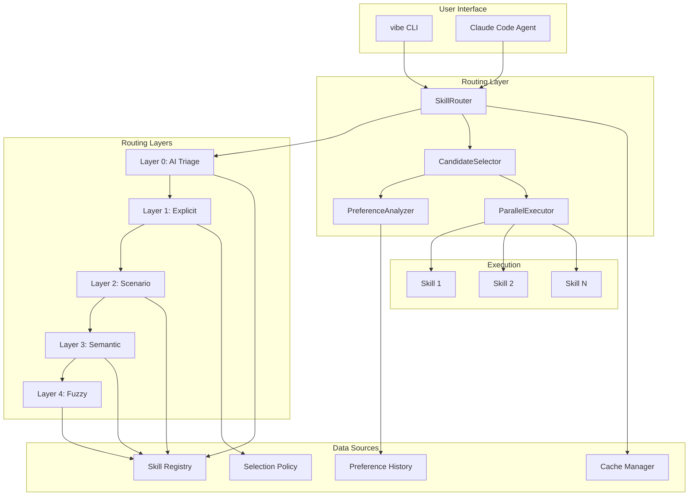
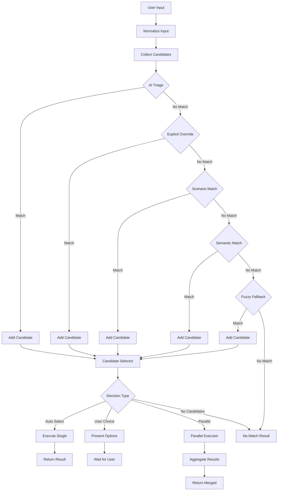
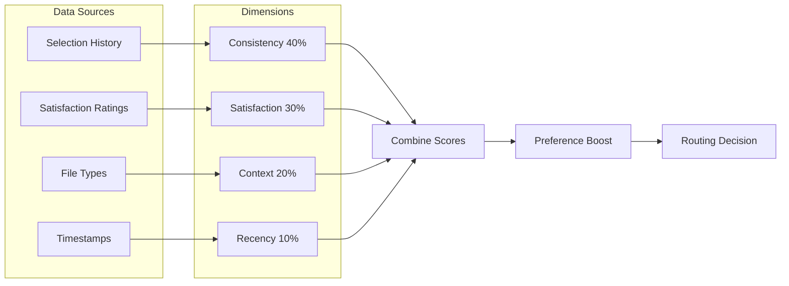
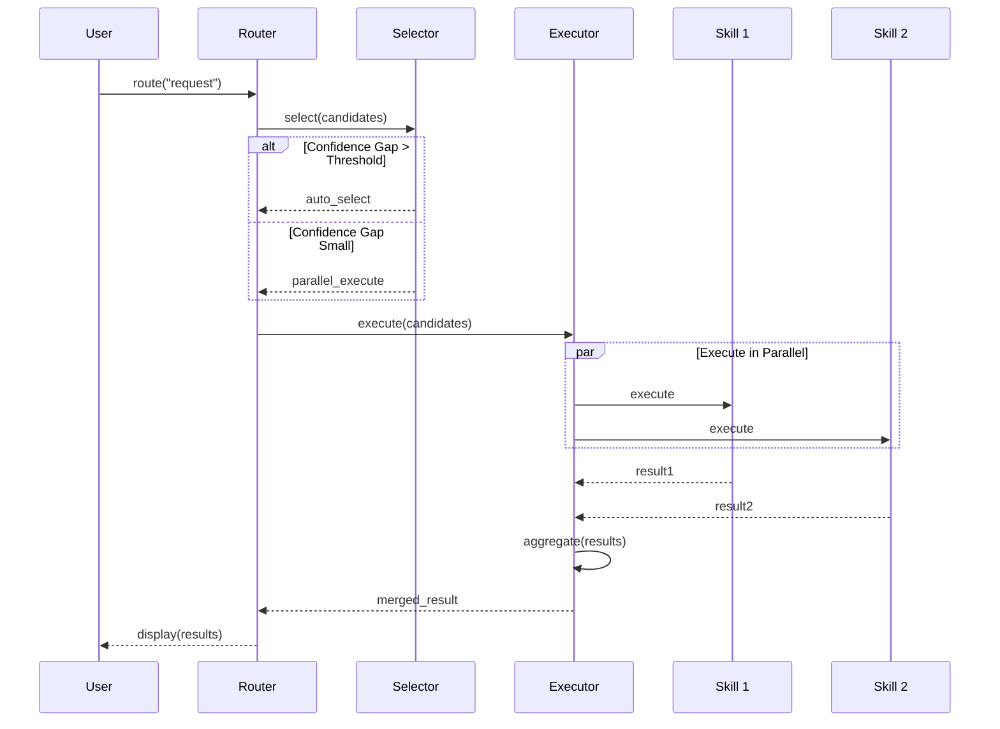
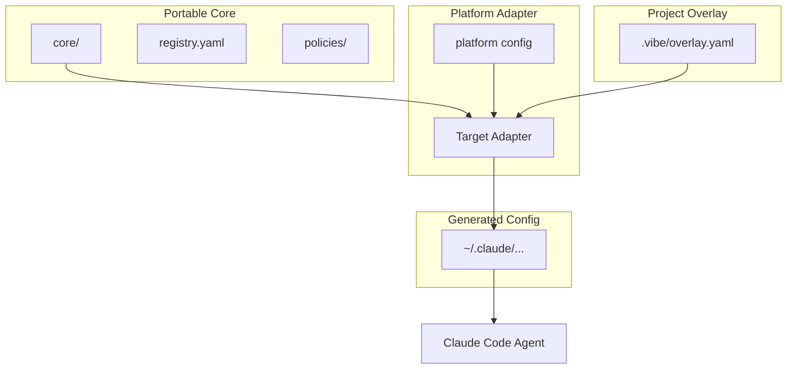
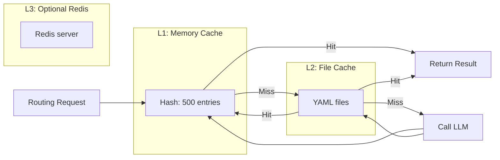
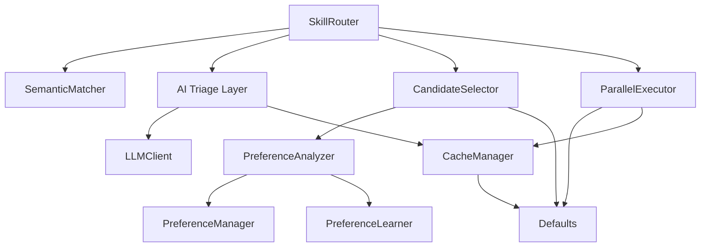

# Architecture Diagrams

**Version**: 1.0.0  
**Last Updated**: 2026-03-30

---

## System Overview

---

## Skill Router Flow

---

## Preference Learning

---

## Parallel Execution

---

## Configuration Flow

---

## Cache Strategy

---

## Module Dependencies

---

## Platform Support Matrix

| Platform | Status | Notes |
|----------|--------|-------|
| Claude Code | ✅ Full | All features supported |
| OpenCode | ✅ Full | All features supported |
| Cursor | 🔄 Planned | Adapter needed |
| VS Code | 🔄 Planned | Extension needed |

---

## Performance Characteristics

| Operation | Latency (p50) | Latency (p95) | Cache Hit |
|-----------|---------------|---------------|-----------|
| Route (cached) | 10ms | 20ms | 70% |
| Route (uncached) | 150ms | 300ms | - |
| Preference analyze | 5ms | 15ms | 90% |
| Parallel execute | 200ms | 500ms | - |
